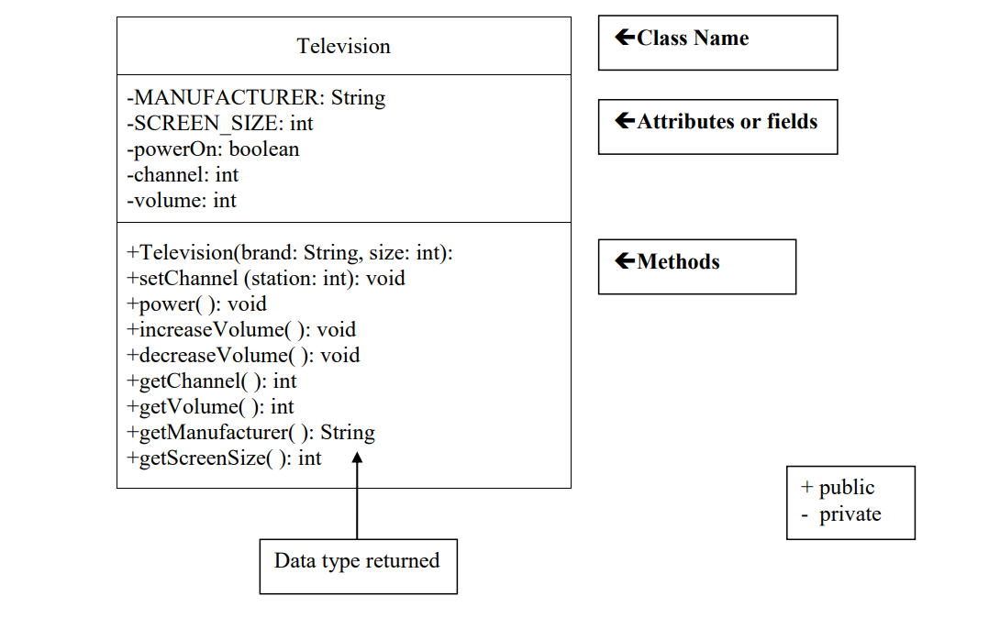

# TelevisionDemo
 Chapter 6 Lab Classes (Television Demo)
 ----------------------------------------------------------------------------------------------------------
 ## Television demo UML ( Unified Modeling Language)
 

-----------------------------------------------------------------------------------------------------------

## Task #1 Creating a New Class
- In a new file, create a class definition called Television.
- Put a program header (comments or documentation) at the top of the file
// The purpose of this class is to model a television
// Your name and today’s date
- Declare the 2 constant fields listed in the UML diagram.
- Declare the 3 remaining fields listed in the UML diagram.
- Write a comment for each field indicating what it represents.
- Save this file as Television.java.
- Compile and debug. Do not run.
-----------------------------------------------------------------------------------------------------------

## Task #2 Writing a Constructor
1. Create a constructor definition that has two parameters, a manufacturer’s brand
and a screen size. These parameters will bring in information.
2. Inside the constructor, assign the values taken in from the parameters to the
corresponding fields.
3. Initialize the powerOn field to false (power is off), the volume to 20, and the
channel to 2.
4. Write comments describing the purpose of the constructor above the method
header.
5. Compile and debug. Do not run.

-----------------------------------------------------------------------------------------------------------

## Task #3 Methods
- Define accessor methods called getVolume, getChannel,
getManufacturer, and getScreenSize that return the value of the
corresponding field.
- Define a mutator method called setChannel that accepts a value to be stored in
the channel field.
- Define a mutator method called power that changes the state from true to
false or from false to true. This can be accomplished by using the NOT
operator (!). If the boolean variable powerOn is true, then !powerOn is
false and vice versa.
Use the assignment statement
powerOn = !powerOn;
to change the state of powerOn and then store it back into powerOn (remember
assignment statements evaluate the right hand side first, then assign the result to
the left hand side variable.
- Define two mutator methods to change the volume. One method should be
called increaseVolume and will increase the volume by 1. The other method
should be called decreaseVolume and will decrease the volume by 1.
- Write javadoc comments above each method header.
Copyright © 2019 Pearson Education, Inc., Hoboken NJ
- Compile and debug. Do not run.

-----------------------------------------------------------------------------------------------------------

## Task #4 Running the Application
- You can only execute (run) a program that has a main method, so there is a
driver program that is already written to test out your Television class. Copy
the file TelevisionDemo.java (see Code Listing 3.1) from the Student Files or
as directed by your instructor. Make sure it is in the same directory
as Television.java.
- Compile and run TelevisionDemo and follow the prompts.
- If your output matches the output below, Television.java is complete and
correct. You will not need to modify it further for this lab.
OUTPUT (boldface is user input)
A 55 inch Toshiba has been turned on.
What channel do you want? 56
Channel: 56 Volume: 21
Too loud! Lowering the volume.
Channel: 56 Volume: 15 

-----------------------------------------------------------------------------------------------------------

## Task #5 Creating another instance of a Television
- Edit the TelevisionDemo.java file.
- Declare another Television object called portable.
- Instantiate portable to be a Sharp 19 inch television.
- Use a call to the power method to turn the power on.
- Use calls to the accessor methods to print what television was turned on.
- Use calls to the mutator methods to change the channel to the user’s preference
and decrease the volume by two.
- Use calls to the accessor methods to print the changed state of the portable.
- Compile and debug this class.
- Run TelevisionDemo again.
- The output for Task #5 will appear after the output from above, since we added
onto the bottom of the program. The output for Task #5 is shown below.
OUTPUT (boldface is user input)
A 19 inch Sharp has been turned on.
What channel do you want? 7
Channel: 7 Volume: 18 

